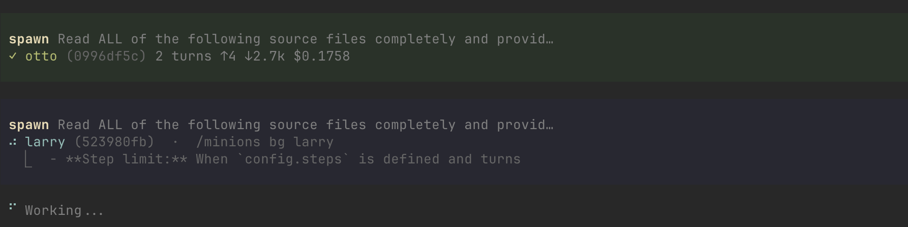

# [oo] pi-minions

[](CHANGELOG.md)
[](LICENSE.md)
[](https://github.com/badlogic/pi-mono/tree/main/packages/coding-agent)

Minimal subagent orchestration for [pi](https://github.com/badlogic/pi-mono/tree/main/packages/coding-agent). No bundled agents, no opinions.



## Why pi-minions?

LLM coding agents hit a wall when tasks get complex: context windows fill up, work can't be parallelized, and one wrong turn wastes the entire session.

pi-minions solves this by letting your agent spawn **minions** — isolated sub-sessions that inherit the parent's configuration while keeping their own context window clean.

- **Context hygiene** — each minion gets a fresh context. Research, analysis, and exploration don't pollute the parent session.
- **Parallelism** — spawn multiple background or foreground minions for independent tasks. Wall-clock time equals the slowest task, not the sum.
- **Safety** — step limits, timeouts, graceful termination, and abort controls prevent runaway agents.

## Install

```bash
pi install https://github.com/kalindudc/pi-minions
```

## Quick start

**Delegate a blocking task** — the parent waits for the result:
```bash
/spawn Analyze error logs and identify root cause

// or just a prompt
Analyze errors logs and identify root cause using minions
```

**Run tasks in parallel** — fire-and-forget, results delivered automatically:
```bash
/spawn --bg Research React 19 server components
/spawn --bg Research Next.js 15 migration guide
/spawn --bg Research Vercel deployment best practices

// or just a prompt
Research React 19 server components with background agents
```

**Use a named agent** — reusable config with model, limits, and prompt:
```bash
/spawn --agent researcher What testing patterns does this project use?

// or a prompt
use our researcher agent to investigate testing patterns of this project
```

**Manage running minions:**
```bash
/minions                         # list running and pending
/minions show kevin              # detailed status + usage
/minions bg kevin                # detach slow foreground task
/minions steer kevin "Focus on src/ only"
/halt kevin                      # abort a minion
```

## Documentation

| Doc | Description |
|-----|-------------|
| [Getting started](docs/getting-started.md) | Install → first spawn → background tasks → agents (~10 min) |
| [Patterns](docs/patterns.md) | "How do I...?" recipes for common workflows |
| [Agents](docs/agents.md) | Creating, configuring, and discovering named agents |
| [Reference](docs/reference.md) | Complete tool and command schemas, types, configuration |
| [Architecture](docs/architecture.md) | Module map, data flow diagrams, design decisions |
| [Contributing](docs/contributing.md) | Dev setup, project structure, testing, release process |
| [E2E testing](docs/e2e-testing.md) | Writing and running agentic end-to-end tests |
| [Changelog](CHANGELOG.md) | Version history |

<details>
<summary><strong>Core concepts</strong></summary>

| Concept | Description |
|---------|-------------|
| **Minion** | An isolated in-process pi session with its own context window |
| **Foreground** | Blocks the parent until complete — use when you need the result to continue |
| **Background** | Returns immediately, result auto-delivered on completion |
| **Agent** | Named markdown config (frontmatter + system prompt) for reusable minion behavior |
| **Steering** | Inject a message into a running minion's context to redirect focus |
| **Live detach** | Move a foreground minion to background mid-execution without interruption |

</details>

## License

MIT — see [LICENSE.md](LICENSE.md)
