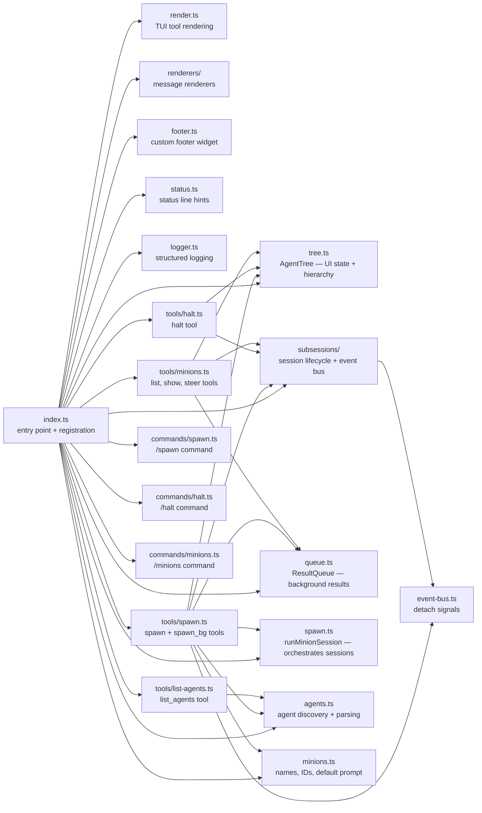
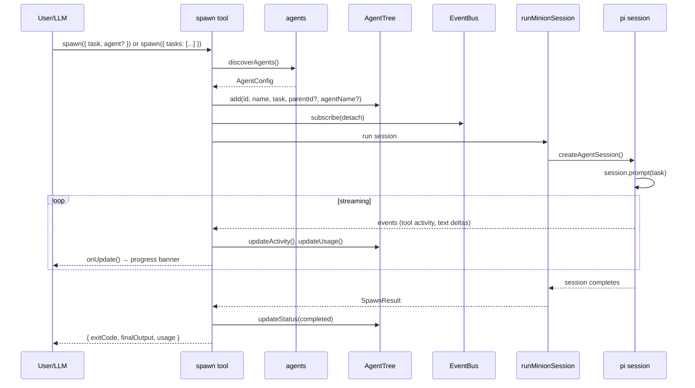
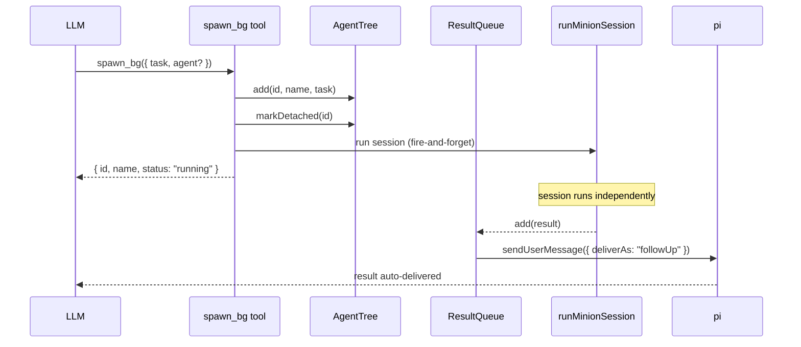

# Architecture

> See also: [Getting started](getting-started.md) · [Reference](reference.md) · [Agents](agents.md)

## Overview

pi-minions is a [pi](https://github.com/mariozechner/pi-coding-agent) extension that adds recursive subagent orchestration. It registers 7 LLM-callable tools and 3 user commands that let a parent session spawn **minions** — isolated in-process agent sessions that inherit the parent's configuration while preventing infinite recursion.

The extension is loaded via `pi -e ./src/index.ts` (development) or `pi install` (production). On load, it creates shared state (agent tree, result queue, abort handles) and registers all tools and commands against the pi extension API.

## Module map

| Module | Purpose |
|--------|---------|
| `index.ts` | Extension entry point — creates shared state, registers tools and commands, wires event listeners |
| `tree.ts` | `AgentTree` — UI state (status, usage, activity, hierarchy) with change notifications |
| `subsessions/` | Session lifecycle, metadata persistence, AgentSession access |
| `subsessions/manager.ts` | `SubsessionManager` — creates and tracks minion sessions |
| `subsessions/event-bus.ts` | `EventBus` — typed event bus for detach signals |
| `queue.ts` | `ResultQueue` — holds completed background results for auto-delivery |
| `spawn.ts` | `runMinionSession()` — orchestrates sessions between AgentTree and SubsessionManager |
| `minions.ts` | Minion name pool, ID generation, default ephemeral prompt template |
| `agents.ts` | Agent discovery from global and project directories, YAML frontmatter parsing |
| `render.ts` | TUI rendering for spawn tool calls (header, progress, footer) |
| `renderers/` | Message renderers for spawn banners and changelogs |
| `footer.ts` | Custom footer widget with minion counts and usage |
| `status.ts` | Status line hints and background minion count |
| `logger.ts` | Structured file-based logging with scoped levels |
| `types.ts` | Shared TypeScript types |
| `tools/*.ts` | LLM-callable tool implementations |
| `commands/*.ts` | User-initiated command handlers |

## Data flow

### Foreground spawn

The parent **blocks** until all minions complete. For batch spawns, all minions run in parallel and aggregate into a single result.

**Detach flow:** When the user runs `/minions bg <name>`, the command emits a detach event via `EventBus`. The spawn tool races `runMinionSession()` against this event — if detach fires first, it returns immediately with "sent to background", wires the result to `ResultQueue`, and the session continues independently.

### Background spawn

The tool returns immediately. The minion is marked `detached` in the tree so the status tracker counts it as background. The session runs independently and its result is auto-delivered via `pi.sendUserMessage()` when complete.

## Key concepts

### Minions and the agent tree

A **minion** is an isolated in-process pi session tracked as an `AgentNode` in the `AgentTree`. Each node has an ID, name, task, status, parent reference, children list, and usage stats. The tree supports arbitrary nesting — a minion can spawn sub-minions (though pi-minions is filtered from child sessions to prevent infinite recursion, TBD).

Names are drawn from a pool of minion names (`minions.ts`) to keep them human-friendly. If all names are in use, the fallback is `minion-<id>`.

### Configuration inheritance

Minions inherit their parent session's configuration through pi's `DefaultResourceLoader`:

- **System prompts** from the parent session (or agent-defined prompt)
- **Extensions** — all parent extensions except pi-minions (automatically filtered)
- **Skills, themes, and prompt templates** from the parent

This means minions have the same capabilities as the parent (custom tools, skills) while the extension filter prevents infinite recursion. The filter works by checking `ext.resolvedPath.includes("pi-minions")`.

### Safety controls

Two independent limits protect against runaway minions:

| Control | Trigger | Behavior |
|---------|---------|----------|
| **Step limit** | `turnCount >= steps` | Steer message → 2 grace turns → force abort |
| **Timeout** | `effectiveTimeout` ms elapsed | Steer message → 30s grace period → force abort |

Both follow the same **graceful termination pattern**: first, a steering message asks the minion to wrap up. If it doesn't finish within the grace window, the session is force-aborted. If the minion finishes within the grace window, it exits cleanly with `exitCode: 0`.

Per-agent `timeout` (from frontmatter) overrides the global `PI_MINIONS_TIMEOUT` environment variable. Step limits are per-agent only (no global setting).

### Agent discovery

Named agents are markdown files with YAML frontmatter discovered from multiple directories:

| Priority | Path | Scope |
|----------|------|-------|
| 1 (lowest) | `~/.pi/agent/agents/` | Global |
| 2 | `~/.pi/agent/minions/` | Global |
| 3 | `~/.agents/agents/` | Global |
| 4 | `.pi/agents/` | Project (walks up to git root) |
| 5 (highest) | `.agents/agents/` | Project (walks up to git root) |

Project-local agents override global agents on name collision. See [Agents](agents.md) for the file format and frontmatter reference.

## Design decisions

### File-based sessions

Minions are file-based pi sessions stored in `~/.pi/sessions/<cwd-hash>/minions/<id>.<name>.jsonl`:

- **Persistence** — minion sessions survive extension reloads
- **Parent tracking** — session metadata stores parent session path
- **Audit trail** — full conversation history on disk
- **Session switching** — pi's native `/session` can open minion sessions

`SubsessionManager` creates sessions via pi's `SessionManager.create()` and tracks active `AgentSession` objects in memory for steer/halt operations.

### AgentTree vs SubsessionManager

We maintain two state managers with clear separation:

| Concern | AgentTree | SubsessionManager |
|---------|-----------|-------------------|
| **Purpose** | UI state & hierarchy | Session lifecycle & persistence |
| **Storage** | In-memory only | File-based with memory cache |
| **Key methods** | `getRunning()`, `resolve()`, `onChange()` | `create()`, `getSession()`, `list()` |
| **Used by** | Status/footer, dashboard, CLI commands | spawn.ts, steer/halt tools |

`spawn.ts` is the **only** module that coordinates both — it creates the session via SubsessionManager, then wires callbacks to update AgentTree for UI notifications.

### EventBus vs AgentTree

Two complementary notification systems for different use cases:

| Concern | EventBus | AgentTree |
|---------|----------|-----------|
| **Pattern** | Push-based events | Pull-based state + change notifications |
| **Scope** | Cross-module signals (detach, progress) | Minion hierarchy and status |
| **Subscribers** | One-shot handlers | Long-lived listeners (UI widgets) |
| **Persistence** | Ephemeral (fire and forget) | In-memory state until minion removed |

**EventBus** handles discrete signals like detach requests: `/minions bg <id>` emits a `detach` event that the spawn tool catches via `Promise.race()`. This decouples commands from spawn implementation — the command does not need a reference to the running spawn promise.

**AgentTree** holds authoritative UI state (status, usage, activity). Widgets like the footer and observability dashboard subscribe via `onChange()` and re-render when state updates. The tree aggregates usage across all minions for the footer display and tracks parent-child relationships for hierarchy views.

Most operations touch both: a detach starts as an EventBus signal, then updates AgentTree's `detached` flag so the UI reflects the new state.

### Abort throws error

The `halt` tool throws an error (rather than returning a value) so pi renders a red `[HALTED]` banner in the UI. The system prompt reinforces "do NOT retry" — this prevents the LLM from interpreting halt as a transient failure and re-spawning the minion.

### Background auto-delivery

Background results are auto-delivered via `pi.sendMessage({ deliverAs: "nextTurn" })`. No manual acceptance or polling is required — the result appears in the parent's context on its next turn. The `ResultQueue` tracks delivery status (`pending` → `accepted`).

### Live detach mechanism

Foreground spawn races `runMinionSession()` against a detach signal via `EventBus`:

- **Normal flow:** session completes → return result to caller
- **Detach flow:** user runs `/minions bg` → `EventBus.emit(id)` → spawn catches signal → wire result to queue → return "sent to background"

The key insight is that the **same session continues** — there's no kill/respawn. The detach just redirects where the result goes.

### Delegation conscience

The extension monitors the parent agent's activity and injects delegation reminders into the system prompt when appropriate. This solves the fundamental problem: the parent has minion tools available but forgets to use them.

**Trigger conditions:**
- 5+ tool calls in current turn
- Prompt exceeds 200 characters
- Keywords detected: investigate, audit, review, refactor, analyze, implement
- Minions were not used previously in this session
- A reminder was not sent within the last 5 minutes.

**Implementation:** Uses `context` event to reminding the parent that parallel execution via minions is available. The hint only appears if minions were not previously used in this session and only once every five minutes matching our constraints.
