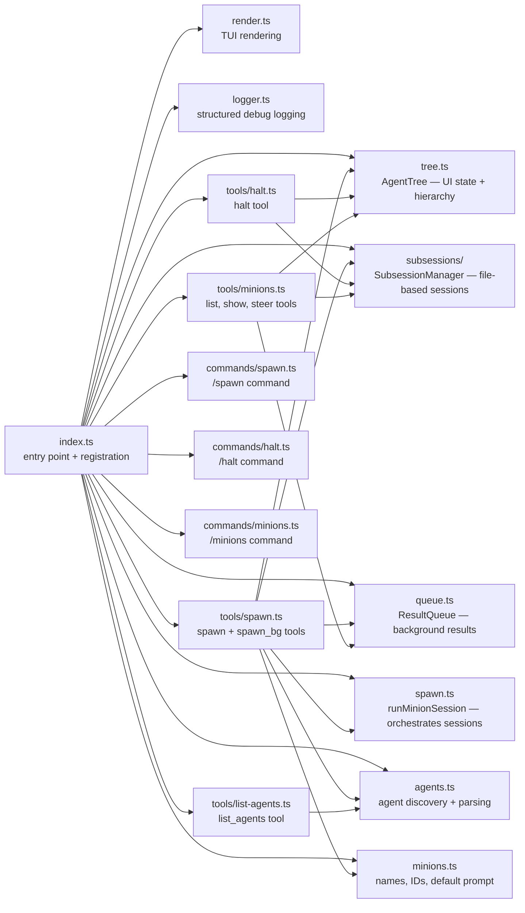
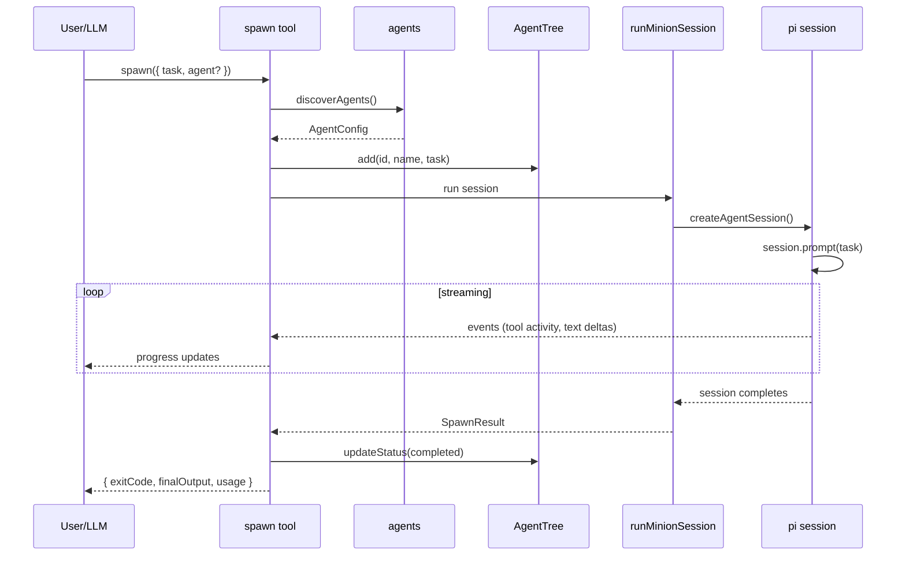
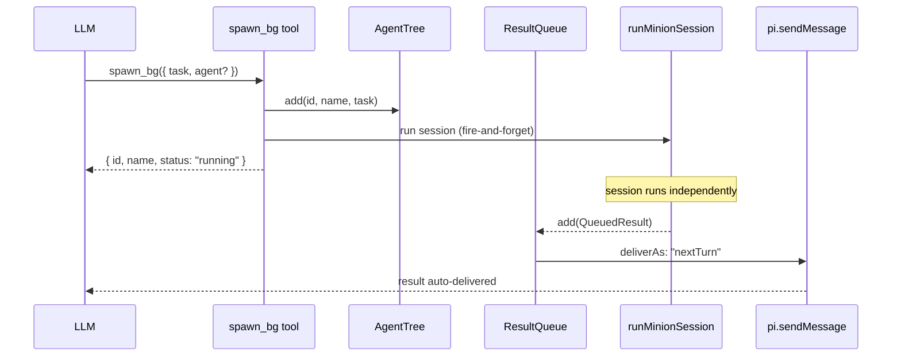

# Architecture

> See also: [Getting started](getting-started.md) · [Reference](reference.md) · [Agents](agents.md)

## Overview

pi-minions is a [pi](https://github.com/mariozechner/pi-coding-agent) extension that adds recursive subagent orchestration. It registers 7 LLM-callable tools and 3 user commands that let a parent session spawn **minions** — isolated in-process agent sessions that inherit the parent's configuration while preventing infinite recursion.

The extension is loaded via `pi -e ./src/index.ts` (development) or `pi install` (production). On load, it creates shared state (agent tree, result queue, abort handles) and registers all tools and commands against the pi extension API.

## Module map

| Module | Purpose |
|--------|---------|
| `index.ts` | Extension entry point — creates shared state, registers tools and commands, wires event listeners |
| `tree.ts` | `AgentTree` — UI state (status, usage, activity, hierarchy) with change notifications |
| `subsessions/` | `SubsessionManager` — file-based session lifecycle, metadata persistence, AgentSession access |
| `queue.ts` | `ResultQueue` — holds completed background results for auto-delivery to the parent |
| `spawn.ts` | `runMinionSession()` — orchestrates between AgentTree (UI) and SubsessionManager (sessions) |
| `minions.ts` | Minion name pool, ID generation, default ephemeral prompt template |
| `agents.ts` | Agent discovery from global and project directories, YAML frontmatter parsing |
| `render.ts` | TUI rendering for spawn tool calls (progress bars, streaming output) and results |
| `logger.ts` | Structured file-based logging with scoped debug/info/warn/error levels |
| `types.ts` | Shared TypeScript types (`AgentConfig`, `AgentNode`, `QueuedResult`, `SpawnResult`, `UsageStats`) |
| `tools/*.ts` | Tool implementations (LLM-callable functions with typed schemas) |
| `commands/*.ts` | Command handlers (user-initiated `/spawn`, `/minions`, `/halt`) |

## Data flow

### Foreground spawn

The parent **blocks** until the minion completes. If the user runs `/minions bg <name>`, the spawn tool detaches: it disconnects the parent's abort signal, wires the result to the queue instead, and returns immediately. The same session continues — no kill/respawn.

### Background spawn

The tool returns immediately. The session runs in the background and its result is auto-delivered to the parent on the next turn via `pi.sendMessage({ deliverAs: "nextTurn" })`.

## Key concepts

### Minions and the agent tree

A **minion** is an isolated in-process pi session tracked as an `AgentNode` in the `AgentTree`. Each node has an ID, name, task, status, parent reference, children list, and usage stats. The tree supports arbitrary nesting — a minion can spawn sub-minions (though pi-minions is filtered from child sessions to prevent infinite recursion, TBD).

Names are drawn from a pool of minion names (`minions.ts`) to keep them human-friendly. If all names are in use, the fallback is `minion-<id>`.

### Configuration inheritance

Minions inherit their parent session's configuration through pi's `DefaultResourceLoader`:

- **System prompts** from the parent session (or agent-defined prompt)
- **Extensions** — all parent extensions except pi-minions (automatically filtered)
- **Skills, themes, and prompt templates** from the parent

This means minions have the same capabilities as the parent (custom tools, skills) while the extension filter prevents infinite recursion. The filter works by checking `ext.resolvedPath.includes("pi-minions")`.

### Safety controls

Two independent limits protect against runaway minions:

| Control | Trigger | Behavior |
|---------|---------|----------|
| **Step limit** | `turnCount >= steps` | Steer message → 2 grace turns → force abort |
| **Timeout** | `effectiveTimeout` ms elapsed | Steer message → 30s grace period → force abort |

Both follow the same **graceful termination pattern**: first, a steering message asks the minion to wrap up. If it doesn't finish within the grace window, the session is force-aborted. If the minion finishes within the grace window, it exits cleanly with `exitCode: 0`.

Per-agent `timeout` (from frontmatter) overrides the global `PI_MINIONS_TIMEOUT` environment variable. Step limits are per-agent only (no global setting).

### Agent discovery

Named agents are markdown files with YAML frontmatter discovered from multiple directories:

| Priority | Path | Scope |
|----------|------|-------|
| 1 (lowest) | `~/.pi/agent/agents/` | Global |
| 2 | `~/.pi/agent/minions/` | Global |
| 3 | `~/.agents/agents/` | Global |
| 4 | `.pi/agents/` | Project (walks up to git root) |
| 5 (highest) | `.agents/agents/` | Project (walks up to git root) |

Project-local agents override global agents on name collision. See [Agents](agents.md) for the file format and frontmatter reference.

## Design decisions

### File-based sessions

Minions are file-based pi sessions stored in `~/.pi/sessions/<cwd-hash>/minions/<id>.<name>.jsonl`:

- **Persistence** — minion sessions survive extension reloads
- **Parent tracking** — session metadata stores parent session path
- **Audit trail** — full conversation history on disk
- **Session switching** — pi's native `/session` can open minion sessions

`SubsessionManager` creates sessions via pi's `SessionManager.create()` and tracks active `AgentSession` objects in memory for steer/halt operations.

### AgentTree vs SubsessionManager

We maintain two state managers with clear separation:

| Concern | AgentTree | SubsessionManager |
|---------|-----------|-------------------|
| **Purpose** | UI state & hierarchy | Session lifecycle & persistence |
| **Storage** | In-memory only | File-based with memory cache |
| **Key methods** | `getRunning()`, `resolve()`, `onChange()` | `create()`, `getSession()`, `list()` |
| **Used by** | Status/footer, dashboard, CLI commands | spawn.ts, steer/halt tools |

`spawn.ts` is the **only** module that coordinates both — it creates the session via SubsessionManager, then wires callbacks to update AgentTree for UI notifications.

### Abort throws error

The `halt` tool throws an error (rather than returning a value) so pi renders a red `[HALTED]` banner in the UI. The system prompt reinforces "do NOT retry" — this prevents the LLM from interpreting halt as a transient failure and re-spawning the minion.

### Background auto-delivery

Background results are auto-delivered via `pi.sendMessage({ deliverAs: "nextTurn" })`. No manual acceptance or polling is required — the result appears in the parent's context on its next turn. The `ResultQueue` tracks delivery status (`pending` → `accepted`).

### Live detach mechanism

Foreground spawn races `runMinionSession()` against a detach promise:

- **Normal flow:** session completes → return result to caller
- **Detach flow:** user runs `/minions bg` → disconnect parent abort signal → wire result to queue → return "sent to background"

The key insight is that the **same session continues** — there's no kill/respawn. The detach just redirects where the result goes.
